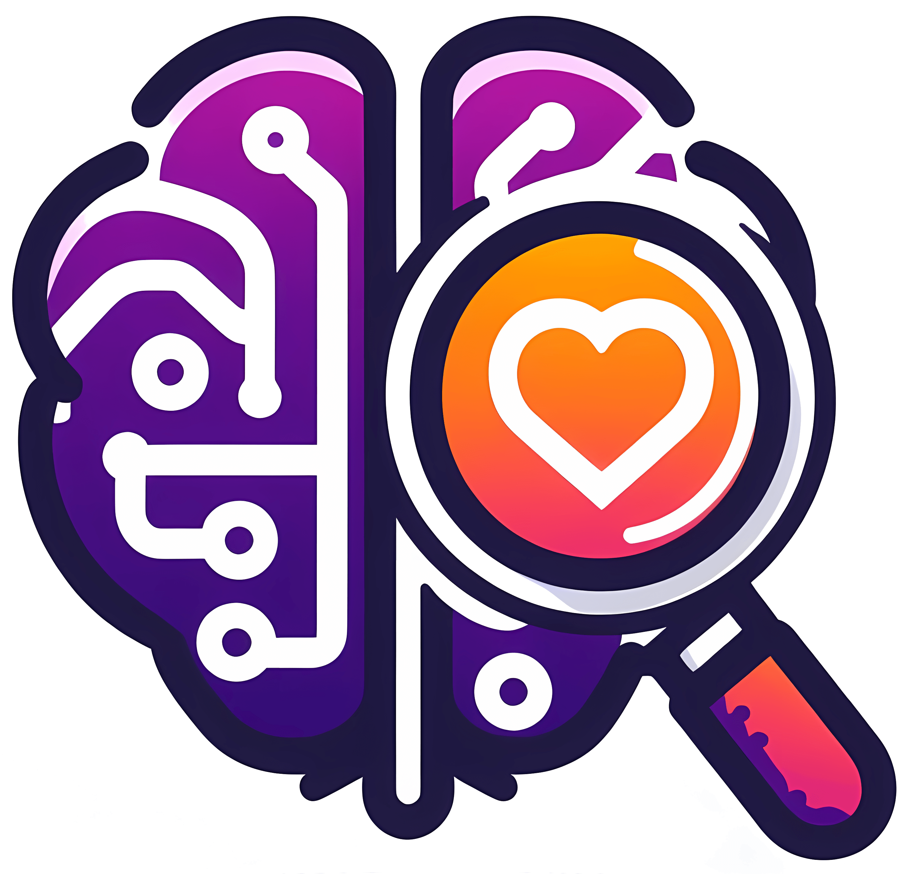

# :brain: TechMatch

### [About](#information_source-about-the-app) • [Features](#heavy_check_mark-features) • [Technologies](#gear-technologies) • [Screenshots](#camera_flash-screenshots) • [Author](#star2-author)

## :information_source: About The App

  

**Front-end** of the webapp **TechMatch**, developed for the paper **"Desenvolvimento de um Web App de Orientação Vocacional Voltado à Prevenção da Evasão em Cursos de TI"**.
> :rocket: Available online on [Vercel](https://techmatch.vercel.app/)!

The **API** of the application can be found at its [GitHub repository](https://github.com/camilafbarcellos/techmatch-api).
> :rocket: Available online on [Render](https://techmatch-api.onrender.com)!

## :heavy_check_mark: Features

## :gear: Technologies

## :camera_flash: Screenshots

## :star2: Author
| 
|--
| <a href="https://github.com/camilafbarcellos">Camila Barcellos</a>

    <a href="#brain-techmatch">↑ Back to top</a>

